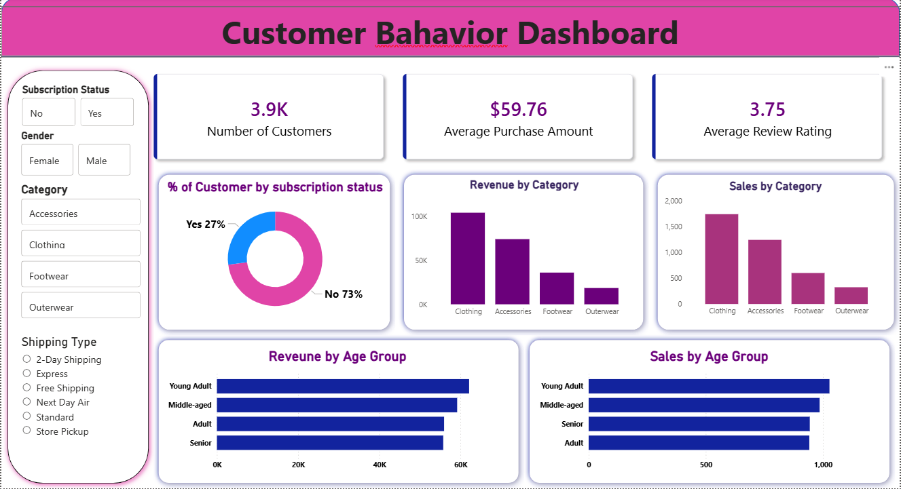

# 📊 Customer Behavior Analysis

An end-to-end **Data Analytics project** focused on understanding customer shopping behavior, purchasing patterns, customer segmentation, loyalty, and factors influencing purchase decisions.

The project uses **Python, SQL, PostgreSQL, and Power BI** to transform customer transaction data into meaningful business insights and actionable recommendations.

---

## 🎯 Project Objective

The objective of this project is to analyze customer shopping behavior and identify opportunities to improve:

* Customer engagement
* Customer retention
* Customer loyalty
* Marketing effectiveness
* Product positioning
* Revenue growth

The analysis examines customer demographics, discounts, reviews, shipping preferences, subscriptions, purchase frequency, and product performance.

---

## 💼 Business Problem

A retail company wants to better understand its customers' shopping behavior to improve sales, customer satisfaction, and long-term loyalty.

Management wants to identify purchasing patterns across customer demographics and understand the factors that influence consumer decisions and repeat purchases.

### Business Question

> **How can the company leverage consumer shopping data to identify trends, improve customer engagement, and optimize marketing and product strategies?**

---

## 🛠️ Tools & Technologies

| Technology          | Usage                                     |
| ------------------- | ----------------------------------------- |
| 🐍 Python           | Data cleaning, preprocessing and EDA      |
| 🐼 Pandas           | Data manipulation                         |
| 🔢 NumPy            | Numerical analysis                        |
| 📊 Matplotlib       | Data visualization                        |
| 📈 Seaborn          | Statistical visualization                 |
| 🗄️ PostgreSQL      | Database and SQL analysis                 |
| 📊 Power BI         | Interactive dashboard                     |
| 📓 Jupyter Notebook | Python development                        |
| 🐙 GitHub           | Project documentation and version control |

---

## 🔄 Project Workflow

```text
Raw Dataset
     ↓
Data Loading
     ↓
Data Cleaning & Preprocessing
     ↓
Exploratory Data Analysis
     ↓
Feature Engineering
     ↓
PostgreSQL Integration
     ↓
SQL Business Analysis
     ↓
Power BI Dashboard
     ↓
Business Insights
     ↓
Recommendations
```

---

## 📊 Dataset

The project analyzes **3,900 customer purchases** containing demographic and behavioral information.

The dataset contains **18 columns** and has **37 missing values**, with the missing values concentrated in the Review Rating column.

### Data Preparation

The following steps were performed:

* Loaded the dataset using Pandas
* Inspected dataset structure
* Checked data types
* Reviewed summary statistics
* Identified missing values
* Handled missing Review Rating values using median imputation
* Created age groups
* Created purchase-frequency segments
* Integrated the cleaned dataset with PostgreSQL

---

## 🐍 Python Analysis

Python was used for data preparation and exploratory data analysis.

### Key Activities

* Data loading
* Data inspection
* Data cleaning
* Missing-value treatment
* Data transformation
* Feature engineering
* Customer segmentation
* Exploratory Data Analysis
* Data visualization

### Python Libraries

```python
Pandas
NumPy
Matplotlib
Seaborn
```

---

## 🗄️ SQL Analysis

PostgreSQL was used to organize the data and perform business-focused analysis.

### Analysis Areas

* Customer segmentation
* Customer loyalty
* Purchase frequency
* Revenue analysis
* Product performance
* Discount behavior
* Subscription behavior
* Shipping preferences
* Customer purchase drivers

### SQL Concepts

```text
SELECT
WHERE
GROUP BY
ORDER BY
CASE
JOIN
Aggregate Functions
Subqueries
Filtering
Segmentation
```

---

# 📈 Power BI Dashboard

An interactive Power BI dashboard was developed to communicate customer behavior and business insights.

### Dashboard Analysis

* Customer overview
* Revenue by gender
* Customer segmentation
* High-value discount users
* Product ratings
* Shipping preferences
* Subscription impact
* Customer loyalty
* Strategic recommendations

---

# 📊 Dashboard Screenshots

### Customer Behavior Analysis Dashboard



> The dashboard provides an interactive view of customer purchasing behavior, customer segments, revenue patterns, product satisfaction, shipping preferences, and subscription behavior.

### 📌 Dashboard Highlights

| Dashboard Area           | Purpose                                       |
| ------------------------ | --------------------------------------------- |
| 👥 Customer Segmentation | Understand New, Returning and Loyal customers |
| 💰 Revenue Analysis      | Compare revenue across customer groups        |
| 🚻 Gender Analysis       | Analyze revenue contribution by gender        |
| 🏷️ Discount Analysis    | Identify high-value discount users            |
| ⭐ Product Analysis       | Identify highly rated products                |
| 🚚 Shipping Analysis     | Compare Express and Standard Shipping         |
| 💳 Subscription Analysis | Understand subscriber spending and loyalty    |
| 🎯 Recommendations       | Convert insights into business actions        |

---

# 💡 Key Business Insights

## 1. Revenue by Gender

Female customers generate slightly higher total revenue than male customers.

This indicates an opportunity to develop targeted marketing strategies based on customer preferences and purchasing behavior.

### Recommendation

Use customer behavior and demographic information to create more personalized marketing campaigns.

---

## 2. High-Value Discount Users

The analysis identified customers who spend above average while actively using discount offers.

These customers represent a valuable **price-conscious premium segment**.

### Recommendation

Target these customers with:

* VIP offers
* Exclusive promotions
* Early access
* Tiered loyalty rewards
* Personalized discounts

The objective is to increase customer retention and purchase frequency.

---

## 3. Top-Rated Products

The analysis identified three highly rated products:

### 👚 Blouse

Highest customer satisfaction rating.

### 👗 Dress

Consistently excellent customer reviews.

### 👔 Shirt

Strong customer approval rating.

### Recommendation

Use these products for:

* Marketing campaigns
* Inventory planning
* Cross-selling
* Product recommendations
* New product benchmarking

---

## 4. Shipping Preference Impact

Customers using Express Shipping have a higher average purchase amount compared with Standard Shipping customers.

| Shipping Type        | Average Purchase |
| -------------------- | ---------------: |
| 🚚 Express Shipping  |          **$65** |
| 📦 Standard Shipping |          **$58** |

Express Shipping customers spend approximately **12% more per transaction**.

### Recommendation

The company could explore premium delivery strategies such as:

* Express delivery promotions
* Premium shipping packages
* Free express shipping above a spending threshold
* Premium customer delivery benefits

---

## 5. Subscription Impact

Subscription customers were identified as one of the most valuable customer segments.

Subscribers:

* Spend more across categories
* Contribute disproportionately to revenue
* Have higher repeat-purchase frequency
* Generate recurring revenue
* Demonstrate stronger customer lifetime value

### Recommendation

Increase subscription adoption through:

* Exclusive benefits
* Early access
* VIP perks
* Subscription discounts
* Member-only promotions

---

# 👥 Customer Segmentation

Customers were categorized into three major groups.

### 🆕 New Customers

First-time buyers representing an important growth opportunity.

### 🔄 Returning Customers

Regular shoppers with moderate purchasing frequency and transaction values.

### ❤️ Loyal Customers

High-value repeat customers with consistent purchasing patterns.

### Customer Growth Strategy

```text
New
 ↓
Returning
 ↓
Loyal
 ↓
Loyal Advocates
```

The primary objective is to convert new customers into returning customers and then develop returning customers into loyal advocates through targeted engagement and personalized experiences.

---

# 🎯 Business Recommendations

## 1. Boost Subscription Adoption

Promote exclusive benefits, early access, and VIP perks to encourage subscription adoption and increase customer lifetime value.

## 2. Implement Loyalty Programs

Introduce tiered reward systems that encourage customers to increase their purchase frequency and move from New to Returning to Loyal.

## 3. Target High-Value Customers

Focus marketing campaigns on high-revenue customer segments such as:

* Express Shipping users
* Female customers
* High-value discount users
* Subscription customers
* Loyal customers

## 4. Improve Product Positioning

Feature top-rated products such as **Blouse, Dress, and Shirt** prominently in campaigns, inventory planning, and cross-selling recommendations.

## 5. Personalize Customer Engagement

Use customer segmentation and purchasing behavior to provide more relevant:

* Offers
* Discounts
* Product recommendations
* Loyalty rewards
* Marketing campaigns

---

# 📌 Key Takeaways

The project demonstrates how customer shopping data can be transformed into actionable business intelligence.

### Major Findings

* Subscription customers demonstrate stronger spending and loyalty behavior.
* Express Shipping customers have higher average transaction values.
* Female customers generate slightly higher total revenue.
* High-value discount users represent an important customer segment.
* Blouse, Dress, and Shirt receive strong customer ratings.
* Customer segmentation can support targeted retention and marketing strategies.

---

# 📁 Project Structure

```text
Customer-Behavior-Analysis/
│
├── 📁 images/
│   └── customer_behavior_dashboard.png
│
├── 📄 customer_shopping_behavior.csv
│
├── 📓 Data Analyst code.ipynb
│
├── 🗄️ sql problems question.sql
│
├── 📊 Customer_behavior_Dashboard.pbix
│
├── 📄 Customer-Shopping-Behavior-Analysis.pdf
│
├── 📄 Business Problem Document.pdf
│
└── 📄 README.md
```

---

# 📦 Project Deliverables

| Deliverable              | Description                             |
| ------------------------ | --------------------------------------- |
| 🐍 Python Notebook       | Data cleaning, transformation and EDA   |
| 🗄️ SQL File             | Business analysis and SQL queries       |
| 📊 Power BI Dashboard    | Interactive customer behavior dashboard |
| 📄 Project Report        | Findings and recommendations            |
| 🖼️ Dashboard Screenshot | Visual representation of dashboard      |
| 🐙 GitHub Repository     | Complete project documentation          |

---

# 🚀 Skills Demonstrated

### Technical Skills

`Python` `Pandas` `NumPy` `Matplotlib` `Seaborn`

`SQL` `PostgreSQL` `Power BI` `Jupyter Notebook`

### Analytical Skills

`Data Cleaning`

`Exploratory Data Analysis`

`Feature Engineering`

`Customer Segmentation`

`KPI Analysis`

`Data Visualization`

`Business Analysis`

`Insight Generation`

`Data-Driven Decision Making`

---

# 💼 Business Value

This project demonstrates an end-to-end approach to converting raw customer transaction data into actionable business insights.

The analysis can help businesses:

* Identify high-value customers
* Improve customer retention
* Increase subscription adoption
* Develop targeted marketing campaigns
* Improve product positioning
* Understand purchasing patterns
* Increase customer lifetime value
* Make data-driven decisions

---

# 👨‍💻 Author

## Manikanthreddy Damma

**Aspiring Data Analyst**

### Skills

`Python` | `SQL` | `Power BI` | `Excel` | `Data Analytics`

### GitHub

🔗 https://github.com/manikanthreddy-1

---

## ⭐ Project Summary

**Customer Behavior Analysis** is an end-to-end Data Analytics project demonstrating the use of **Python, SQL, PostgreSQL, and Power BI** to analyze customer shopping behavior.

The project converts raw customer data into meaningful insights around **customer segmentation, loyalty, subscriptions, discounts, shipping preferences, product ratings, and revenue patterns**, followed by practical recommendations for improving customer engagement and business growth.
